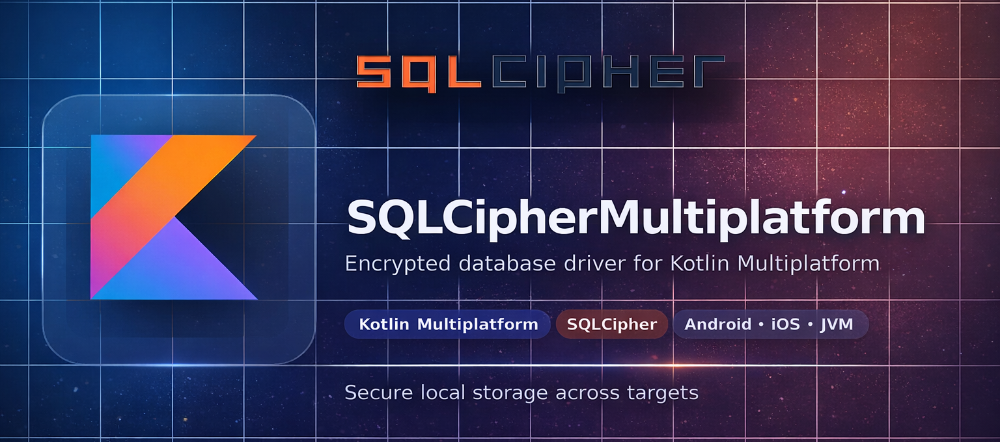

<p align="center">
  
</p>

<h1 align="center">SQLCipherMultiplatform</h1>

<p align="center">
  <a href="https://search.maven.org/artifact/io.github.s0d3s/sqlcipher-multiplatform"></a>
  
  <a href="https://opensource.org/licenses/Apache-2.0"></a>
  <a href="https://github.com/s0d3s/SQLCipherMultiplatform/releases"></a>
  <a href="https://github.com/s0d3s/SQLCipherMultiplatform/actions/workflows/ci.yml"></a>
</p>

**SQLCipher Multiplatform** is a _Kotlin Multiplatform_ library that brings encrypted **SQLite** support to KMP projects. It unifies database access across Android and JVM, using **SQLCipher** under the hood, and ships with a JNI-backed JDBC driver for desktop and backend JVM environments

## Features

- Unified Kotlin Multiplatform API for encrypted SQLite operations
- JVM support via custom SQLCipher JDBC driver (`jdbc:sqlcipher:`)
- Android support via SQLCipher for Android integration
- Native payload packaging for major desktop/server JVM platforms
- CI-friendly sample verification flows (CRUD, encrypted-at-rest checks, wrong-key rejection)

## Install in a KMP project

```kotlin
repositories {
    google()
    mavenCentral()
}

val sqlcipherVersion = "<latest-version>"

kotlin {
    sourceSets {
        commonMain.dependencies {
            implementation("io.github.s0d3s:sqlcipher-multiplatform:$sqlcipherVersion")
        }
    }
}
```

### Optional: platform-specific JDBC-only module

```kotlin
dependencies {
    implementation("io.github.s0d3s:sqlcipher-multiplatform-jdbc-<platform>:<latest-version>")
}
```

> `platform` is combination of platform name + architecture: (linux|macos|windows)-(x64|arm64)

## Platform support / compatibility

- **KMP API targets:** JVM, Android
- **iOS:** not implemented yet
- **JVM native payloads:** windows-x64, linux-x64, linux-arm64, macos-x64, macos-arm64
- **Toolchain baseline:** Java 17, Kotlin 2.3.x
- **Android baseline:** minSdk 24

## Quick usage (Kotlin)

```kotlin
import io.github.s0d3s.sqlcipher.multiplatform.api.SqlCipherDatabaseFactory

SqlCipherDatabaseFactory.initialize() // JVM no-op; on Android pass applicationContext

val db = SqlCipherDatabaseFactory.open("app.db", "my-secret-key")
db.execute("CREATE TABLE IF NOT EXISTS notes(id INTEGER PRIMARY KEY, text TEXT NOT NULL)")
db.execute("INSERT INTO notes(text) VALUES ('hello')")

val rows = db.querySingleColumn("SELECT text FROM notes ORDER BY id")
println(rows) // [hello]

db.close()
```

## Usage / testing examples

Executable examples live in:

- `samples/kmp-basic-app` — direct KMP API usage (`SqlCipherDatabaseFactory`)
- `samples/kmp-sqldelight-app` — SQLDelight on top of SQLCipher JDBC

Run sample checks:

```bash
./gradlew :samples:kmp-basic-app:verifySample
./gradlew :samples:kmp-sqldelight-app:verifySample
./gradlew verifySamples
```

## Project structure

- `sqlcipher-multiplatform/` — KMP library API (`commonMain`, `jvmMain`, `androidMain`)
- `sqlcipher-multiplatform-jdbc-core/` — custom JDBC driver (`jdbc:sqlcipher:`)
- `native-bridge/` — JNI + CMake bridge to SQLCipher/OpenSSL
- `native-artifacts/` — platform-native runtime packaging modules
- `samples/` — runnable verification examples
- `third_party/sqlcipher/` — SQLCipher amalgamation and upstream submodule

## Minimal setup & validation (contributors)

Install Conan 2 and initialize profile once:

```bash
python -m pip install conan
conan profile detect --force
```

```bash
git submodule update --init --recursive third_party/sqlcipher/upstream
./gradlew updateSqlcipherAmalgamation
./gradlew :native-bridge:buildNative
./gradlew :sqlcipher-multiplatform-jdbc-core:nativeSmokeTest
./gradlew verifySamples
```

## Licensing notes

- This project is licensed under **Apache-2.0**.
- It integrates upstream **SQLCipher** sources/components from [`sqlcipher/sqlcipher`](https://github.com/sqlcipher/sqlcipher), which are distributed under a **BSD-style license**. Please review upstream licensing terms when redistributing binaries.
